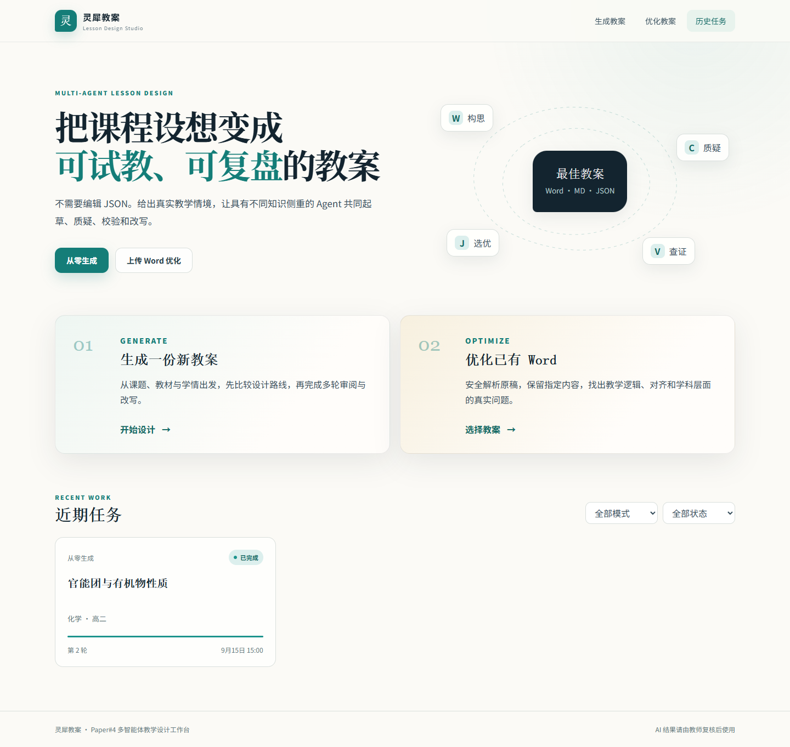
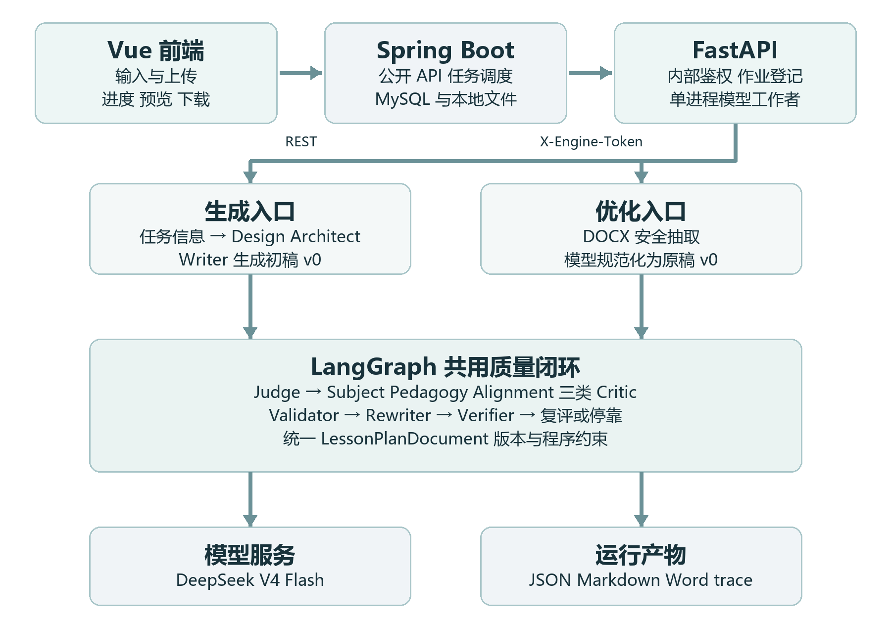

# Lessongen（灵犀教案）

面向教师与师范生的多智能体教案生成、审查与 Word 优化系统。Python/LangGraph 负责真实模型闭环，Spring Boot 负责任务、数据库与文件管理，Vue 负责生成、优化、过程展示和结果下载。

> 当前状态：研究原型 / 本地部署 MVP。系统不使用 Mock 教案冒充成功；内部 Judge 分数只用于管线路由，不能替代教师评价或论文实验结论。



## 主要功能

- 输入科目、年级、课题等信息生成结构化教案；
- 上传任意常见结构的 `.docx` 教案，解析后进行多轮定向优化；
- Design Architect、Writer、三类 Critic、Validator、Judge、Rewriter 分工协作；
- 记录版本、意见、裁决、实际修改、评分、token、费用和停止原因；
- 输出 JSON、Markdown、Word、manifest、trace 和优化报告；
- 页面展示任务阶段、模型用量、八维内部质量与“具体改了什么”；
- 对宏、加密包、嵌入 OLE、路径穿越和异常压缩包执行安全拦截；
- 不访问 Word 中的外部链接、外链图片或外部模板。

## 仓库结构

```text
Lessongen/
├── paper4_pipeline/       Python、LangGraph、FastAPI、DOCX 解析与导出
├── web/                   Spring Boot、MySQL/Flyway、Vue 3
│   ├── frontend/          Vue/TypeScript 前端
│   ├── src/               Java 后端
│   └── specs/             功能、接口、数据模型和 UI 规范
├── docs/                  项目架构说明
├── SECURITY.md            密钥、文档与部署安全边界
└── CONTRIBUTING.md        开发与提交规范
```

详细设计见 [项目架构与开发说明](docs/PAPER4_PROJECT_GUIDE.md)。

## 系统架构

```text
Browser
  │ /api/v1 + SSE
  ▼
Vue 3 / TypeScript
  ▼
Spring Boot 4 ───── MySQL 8
  │ /internal/v1 + X-Engine-Token
  ▼
FastAPI internal engine ───── 本地受控文件存储
  ▼
LangGraph / PipelineService
  ├─ Generate: Design Architect → Writer → Judge
  └─ Optimize: DOCX → normalized v0 → Judge
                       ↓
      Subject + Pedagogy + Alignment Critics
                       ↓
       Validator → targeted Rewriter → Verifier
                       ↓
                    Judge / Router（最多三轮）
```



## Agent 分工

| 角色 | 职责 | 输出 |
| --- | --- | --- |
| Design Architect | 比较候选认知路径并选择设计主线 | `LessonDesignBlueprint` |
| Writer | 将蓝图展开成完整初稿 | `LessonPlanDocument` |
| Subject Critic | 学科事实、条件、教材边界与误概念 | `CritiqueItem[]` |
| Pedagogy Critic | 认知进阶、支架、参与、差异化与可实施性 | `CritiqueItem[]` |
| Alignment Critic | 目标—活动—产出—评价一致性 | `CritiqueItem[]` |
| Validator | 去重、接受、拒绝、合并、延期 | `ValidationBatch` |
| Rewriter | 执行已接受意见并提交字段级修改 | `RewriteOutcome` |
| Verifier | 确定性核验与回归检测 | 状态迁移与回归标记 |
| Judge | 冻结八维内部评价 | `EvaluationReport` |

优化模式采用“相对原稿不退步”的校验：外部原稿可以分轮补齐；局部修改不会因为其他尚未修复的问题被误杀，但任何新增硬错误、身份篡改、伪修改或悬空引用都会被拒绝。

## 技术栈

- Python 3.11、uv 锁文件、Pydantic 2、LangGraph、FastAPI；
- DeepSeek OpenAI-compatible API；
- Java 17、Spring Boot 4、Spring Data JPA、Flyway；
- MySQL 8；
- Vue 3、TypeScript、Vite、Pinia、Element Plus、ECharts；
- pytest、JUnit、Testcontainers、Vitest、Playwright。

## 快速启动

唯一推荐运行目录是当前 Git 仓库根目录；在你的机器上是 `F:\comalesson\Lessongen`。`C:\Users\Administrator\Desktop\PR` 只是旧副本，不再作为启动入口。请先停止旧 C 盘服务，避免 5173/8080 端口被旧进程占用；不要删除旧数据。

### 一键启动完整 Web（推荐）

```bat
cd /d F:\comalesson\Lessongen
scripts\up.cmd
```

前提仅需 Docker Desktop。首次运行会在仓库根目录创建被 Git 忽略的 `.env`：若已有 `paper4_pipeline/.env`，会复用其中的 DeepSeek Key 和内部 Token；否则只会在终端隐藏式询问 Key，其余密码自动生成。它不会打印密钥。此命令构建并启动 MySQL、Python 引擎、Spring Boot 和前端，等待服务启动后访问 `http://127.0.0.1:5173`。生成/优化教案会调用付费模型，启动与健康检查不会。关闭时运行 `scripts\down.cmd`，不会删除数据库卷或教案文件。

Docker 数据独立保存在 `runtime/engine/`、`runtime/web/` 和 Docker 命名卷中，不会自动迁移旧的 C/F 历史任务。MySQL 映射主机 `3307`，Java 映射 `8080`；引擎 `8001` 仅供容器内部访问。若旧进程占用这些端口，先确认进程来源并停止旧服务，再运行启动命令。不要对已有数据库卷随意更换 `.env` 中的 DB 密码。

### 不使用 Docker 的 Python 开发

不再要求 `conda PR4`。只需安装 [uv](https://docs.astral.sh/uv/getting-started/installation/)；仓库 `.python-version` 固定 Python 3.11，uv 在本机没有该版本时会自动下载。然后在仓库根目录执行：

```bat
cd /d F:\comalesson\Lessongen
uv sync --project paper4_pipeline --locked --extra web --extra dev
web\scripts\start-web-engine.cmd --check
web\scripts\start-web-engine.cmd
```

启动脚本只使用 `paper4_pipeline\.venv`，并检查实际导入的 Provider 必须来自本仓库；`--check` 不启动服务或调用付费模型。需在仓库根 `.env` 设置 `DEEPSEEK_API_KEY` 和 `ENGINE_INTERNAL_TOKEN`（可先运行 `powershell -NoProfile -ExecutionPolicy Bypass -File scripts\setup-local.ps1`）。本地 CLI 也使用同一个环境：

```bat
paper4_pipeline\.venv\Scripts\python.exe -m paper4_pipeline.cli generate
```

如需独立启动 Java/Vue，可见 [Web Quickstart](web/specs/001-lesson-plan-web/quickstart.md)；完整 Web 优先使用上面的一键 Docker 入口。

根目录 `.env` 的可配置项参见 [示例](.env.example)：

```dotenv
DEEPSEEK_API_KEY=你的真实密钥
DEEPSEEK_BASE_URL=https://api.deepseek.com
ENGINE_INTERNAL_TOKEN=一段随机长字符串
DB_PASSWORD=本地数据库密码
MYSQL_ROOT_PASSWORD=另一个数据库密码
```

## 测试

```bat
cd /d F:\comalesson\Lessongen
paper4_pipeline\.venv\Scripts\python.exe -m pytest -q paper4_pipeline\tests

cd web
mvnw.cmd test

cd frontend
npm ci
npm test
npm run lint
npm run build
```

GitHub Actions 对 Python 锁文件、Java/MySQL 迁移、Vue 静态与 E2E、Docker 镜像构建及密钥泄露进行检查。自动测试不会调用付费模型；本机若未启动 Docker，Java 的 Testcontainers 迁移测试会跳过，CI 会把这种跳过判为失败。

## 运行数据

一键 Docker 路线的数据写入被 Git 忽略的目录与 Docker 命名卷：

```text
runtime/engine/engine-state/
runtime/engine/engine-artifacts/
runtime/web/web-storage/
Docker 卷 lessongen_mysql_data
```

其中可能包含上传原文、生成教案、模型响应、trace 和费用信息，不得提交到公共仓库。

## 敏感信息

仓库只提交 `.env.example`。`.env`、API Key、数据库密码、内部 Token、上传 Word、数据库、运行产物、依赖缓存和本机路径均已排除。完整要求见 [SECURITY.md](SECURITY.md)。

## 已知边界

- 当前为单机 MVP，付费任务默认串行；
- Word 图片不执行 OCR，需要人工核对；
- Paper#3 课堂模拟尚未接入主图；
- RAG 权威课程标准库、用户登录和公网多租户部署尚未完成；
- 内部评分不等于真实教学效果，仍需教师与专家实验；
- 仓库暂未添加开源许可证。

## 文档

- [完整架构说明](docs/PAPER4_PROJECT_GUIDE.md)
- [Python 引擎说明](paper4_pipeline/README.md)
- [Python 运行指南](paper4_pipeline/docs/RUN_GUIDE.md)
- [优化闭环说明](paper4_pipeline/docs/OPTIMIZATION_WORKFLOW.md)
- [Web 说明](web/README.md)
- [Web Spec](web/specs/001-lesson-plan-web/README.md)
- [安全说明](SECURITY.md)
- [贡献指南](CONTRIBUTING.md)

> Java 包名和部分内部历史标识仍保留 `lesoongen`，用于兼容现有数据库与接口；对外仓库和产品名称统一为 **Lessongen**。
